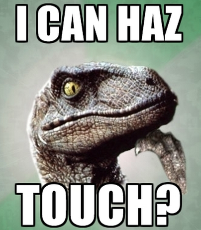

# haz-touch [](https://travis-ci.org/hemanth/haz-touch)

> Is it a touchable device?



## Install

```
$ npm install --save haz-touch
```


## Usage

```js
var hazTouch = require('haz-touch');

if(hazTouch) {
	console.log('Hurrey! I can haz touch');
}
```

## License

MIT © [hemanth.hm](http://h3manth.com)
